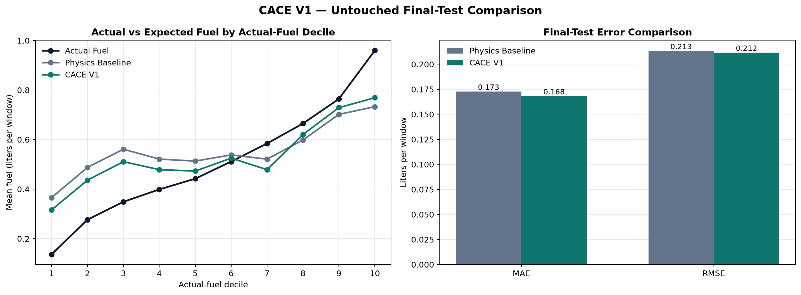
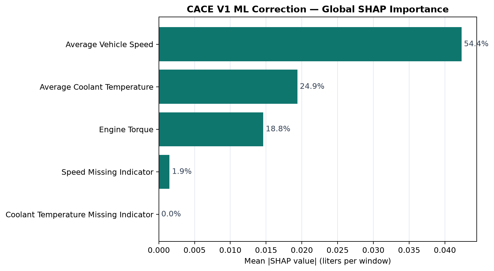
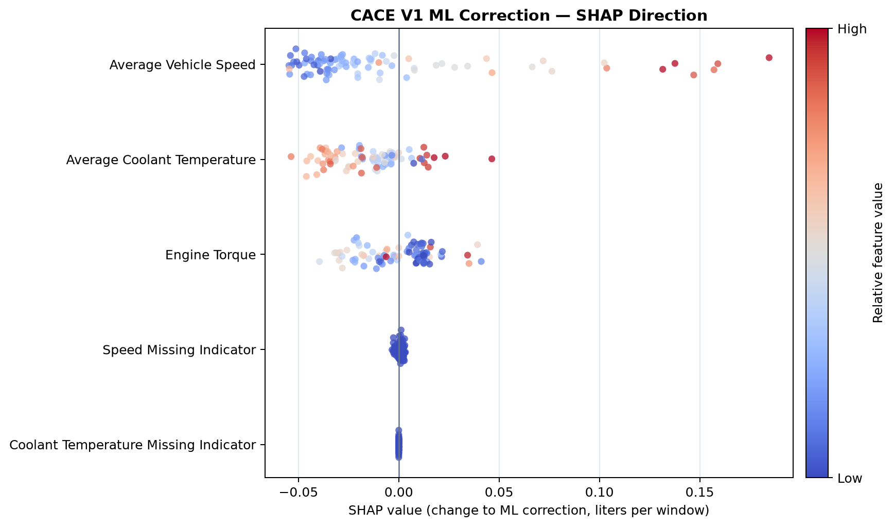
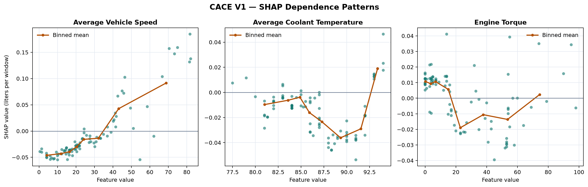
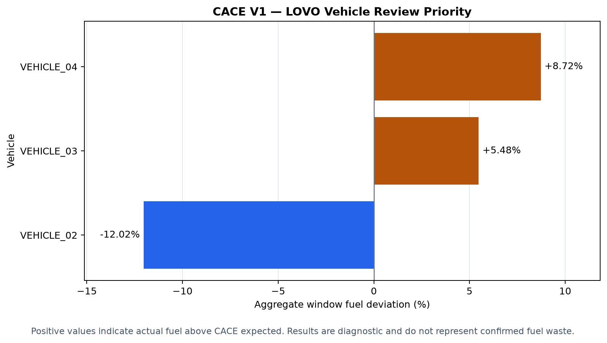
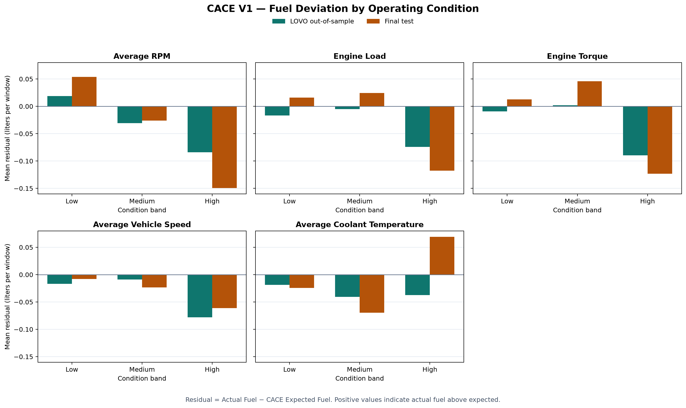

# CACE V1 Business & Interpretation Report

**Version:** 1.0  
**Analysis scope:** Phase 10 — Interpretation & Business Analysis  
**Model status:** Validated diagnostic prototype  

## Executive Summary

CACE V1 estimates expected fuel consumption with a physics-first architecture. A transparent physics baseline produces the initial estimate, and a Random Forest model predicts a residual correction using additional operating-condition features.

On the untouched final test set, CACE V1 reduced mean absolute error from **0.173 L to 0.168 L per window**, a **2.64% improvement** over the physics baseline. RMSE improved by **0.79%**, while R² increased from **0.201 to 0.214**. These results show that the ML correction adds measurable value, but the gain is modest.

Leave-one-vehicle-out (LOVO) validation was mixed. The observation-weighted MAE increased slightly from **0.184 L to 0.186 L per window**, and only one of three held-out vehicles improved on both MAE and RMSE. CACE V1 should therefore be used to support diagnostic review, not as a production fuel-efficiency score or a direct estimate of fuel savings.

The main findings are:

- Average vehicle speed was the largest driver of the ML residual correction, representing **54.4%** of global SHAP importance.
- CACE V1 produced a closer decile-level mean estimate than the physics baseline in **9 of 10** final-test fuel deciles.
- `VEHICLE_04` had the highest positive LOVO aggregate deviation at **+8.72%** and is the first vehicle to review.
- Low RPM was the strongest operating-condition review signal repeated across both LOVO and final-test results.
- The model is suitable for continued development and diagnostic screening, but the evidence does not yet support production deployment.

## 1. Business Objective

The purpose of CACE V1 is to estimate how much fuel a vehicle would be expected to use under its observed operating conditions and then compare that estimate with actual fuel consumption.

The model follows this structure:

```text
CACE Expected Fuel = Physics Expected Fuel + ML Residual Correction
Fuel Deviation     = Actual Fuel - CACE Expected Fuel
```

A positive deviation means actual fuel was above the model's expectation. A negative deviation means actual fuel was below the expectation. Neither result proves waste or efficiency by itself; it identifies where further operational or engineering review may be useful.

## 2. Validation Framework

Two validation views were used because they answer different questions.

| Validation view | Scope | Primary question |
|---|---:|---|
| Untouched final test | 87 observations | Does the final model improve predictions on data not used during model selection? |
| LOVO out-of-sample validation | 425 observations across 3 held-out vehicles | Does the model generalize to a vehicle excluded from training? |

The final test is the primary source for SHAP interpretation and final model performance. LOVO predictions are the primary source for vehicle deviation and review-priority analysis.

## 3. Model Performance

### 3.1 Untouched Final Test

| Metric | Physics baseline | CACE V1 | Change |
|---|---:|---:|---:|
| MAE | 0.1727 L/window | 0.1682 L/window | **2.64% improvement** |
| RMSE | 0.2133 L/window | 0.2116 L/window | **0.79% improvement** |
| R² | 0.2009 | 0.2135 | +0.0126 |

CACE V1 improved all three final-test metrics, but the difference from the physics baseline is small. The practical conclusion is that the residual model provides incremental correction rather than replacing the physics baseline.



### 3.2 Actual vs Expected Fuel Pattern

The decile comparison shows a consistent calibration pattern:

- At lower actual-fuel levels, both models generally overpredict fuel consumption.
- At higher actual-fuel levels, both models generally underpredict fuel consumption.
- CACE V1 moves the decile-level mean closer to actual fuel in 9 of 10 deciles.
- The remaining bias indicates that additional operating-condition information is still missing.

This is evidence of a useful but incomplete correction. It should not be described as a fully calibrated production model.

### 3.3 Cross-Vehicle Generalization

Across the three LOVO folds, the observation-weighted results were:

| Metric | Physics baseline | CACE V1 | Result |
|---|---:|---:|---|
| MAE | 0.1844 L/window | 0.1857 L/window | 0.67% worse |
| RMSE | 0.2420 L/window | 0.2457 L/window | 1.52% worse |

The ML correction improved both MAE and RMSE for `VEHICLE_03`, but it did not improve both metrics for `VEHICLE_02` or `VEHICLE_04`. This mixed result is the main reason CACE V1 remains a diagnostic prototype.

## 4. SHAP Model Interpretation

SHAP explains how the Random Forest changes the physics estimate. It does **not** measure each feature's total effect on fuel consumption, and it does not establish causality.

### 4.1 Global Feature Importance

| Rank | Feature | Mean absolute SHAP | Importance share |
|---:|---|---:|---:|
| 1 | Average Vehicle Speed | 0.0423 L/window | **54.4%** |
| 2 | Average Coolant Temperature | 0.0194 L/window | **24.9%** |
| 3 | Engine Torque | 0.0146 L/window | **18.8%** |
| 4 | Speed Missing Indicator | 0.0015 L/window | **1.9%** |
| 5 | Coolant Temperature Missing Indicator | 0.0000 L/window | **0.0%** |

Average vehicle speed was the most influential feature **within the ML residual correction**. This does not mean speed was the largest overall or causal driver of fuel consumption. RPM and engine load already contribute through the physics baseline and are therefore not included in this SHAP ranking.



### 4.2 Direction and Dependence

- **Average vehicle speed:** Higher values generally produced positive SHAP values, increasing the correction added to the physics estimate. Lower speeds generally reduced the correction.
- **Average coolant temperature:** The relationship was weaker and nonlinear. Mid-range temperatures generally reduced the correction, while a small number of high-temperature observations increased it.
- **Engine torque:** Higher torque generally reduced the ML correction, but the relationship was also nonlinear.
- **Missing indicators:** Direction could not be estimated because the final-test rows did not contain missing speed or coolant-temperature values.

These patterns describe how the model behaves. For example, a positive speed SHAP value means the model raised expected fuel relative to the physics estimate; it does not mean that increasing speed will necessarily cause the same fuel change in another operational setting.





## 5. Vehicle Fuel Deviation and Review Priority

Vehicle-level deviation was calculated from LOVO out-of-sample predictions:

```text
Aggregate Fuel Deviation (%) =
    (Sum of Actual Fuel - Sum of CACE Expected Fuel)
    / Sum of CACE Expected Fuel × 100
```

| Review rank | Vehicle | CACE deviation | Positive-deviation windows | Interpretation |
|---:|---|---:|---:|---|
| 1 | `VEHICLE_04` | **+8.72%** | 57.5% | Highest positive deviation; first review priority |
| 2 | `VEHICLE_03` | **+5.48%** | 51.6% | Moderate positive deviation; second review priority |
| — | `VEHICLE_02` | **−12.02%** | 33.9% | Actual fuel was below CACE expected; review model overprediction |

`VEHICLE_04` is the clearest positive screening signal. Its aggregate deviation was +9.20% against the physics baseline and +8.72% against CACE, so the ML correction slightly reduced the absolute deviation. For `VEHICLE_03` and `VEHICLE_02`, the correction increased the absolute aggregate deviation.

`VEHICLE_02` should not automatically be labeled efficient. A negative deviation can also result from model bias, incomplete operating-condition features, or differences between vehicles.



## 6. Operating-Condition Findings

Operating conditions were divided into data-relative Low, Medium, and High bands. These bands describe this dataset and are not universal engineering thresholds.

### 6.1 Primary Review Signal: Low RPM

Low RPM was the strongest positive condition repeated in both validation views.

| Validation view | Observations | Mean RPM | Mean residual | Positive-deviation rate |
|---|---:|---:|---:|---:|
| LOVO out-of-sample | 142 | 1,039 rpm | **+0.0186 L/window** | 50.7% |
| Final test | 36 | 1,049 rpm | **+0.0537 L/window** | 55.6% |

The repeated positive direction makes low RPM the first operating condition to investigate. Possible explanations include low-speed operation, idling, transient behavior, or features that are not currently captured. The result does not prove that low RPM itself causes excess fuel use.

### 6.2 Secondary Review Signal: Medium Torque

Medium engine torque also had positive mean residuals in both views:

- LOVO: +0.0019 L/window across 140 observations.
- Final test: +0.0460 L/window across 26 observations.

The LOVO effect is close to zero, so medium torque should be treated as a weak supporting signal rather than a primary finding.

### 6.3 Other Conditions

High RPM, high engine load, and high torque produced negative mean residuals in both validation views. This means CACE expected more fuel than was observed in those bands; it does not prove that those operating conditions are efficient. High coolant temperature was inconsistent across the two validation views and does not support a stable conclusion.



## 7. Business Insights and Recommendations

### Insight 1: Retain the physics-first architecture

The physics baseline remains the stable and transparent reference. The ML model should continue to operate as a correction layer because its final-test benefit is incremental and its cross-vehicle performance is mixed.

### Insight 2: Review `VEHICLE_04` first

`VEHICLE_04` has the largest positive LOVO deviation and the highest positive-deviation window rate. The next analysis should determine whether its deviation is concentrated in specific time periods, routes, or operating conditions before any maintenance or efficiency conclusion is made.

### Insight 3: Investigate low-RPM operation

Low RPM is the most repeatable operating-condition signal. A targeted drill-down should compare low-RPM windows by vehicle and examine speed, idle behavior, load, coolant temperature, and trip context.

### Insight 4: Do not convert window deviations into savings claims

The ±60-second modeling windows can overlap. Summed window fuel therefore represents diagnostic exposure, not unique fleet fuel consumption. The current results cannot be converted directly into total liters wasted, cost savings, or emissions reduction.

### Insight 5: Improve vehicle generalization before deployment

The model should be retrained only after adding more vehicles and more representative operating conditions. Promotion beyond prototype status should require consistent improvement over the physics baseline on both an untouched time-based test and unseen-vehicle validation.

### Insight 6: Prioritize higher-frequency telemetry

More frequent and better-aligned fuel, speed, RPM, load, and torque observations would reduce window uncertainty. Additional context such as grade, payload, route, ambient conditions, and idle state may also explain the remaining calibration bias.

## 8. Limitations

- The untouched final test contains 87 observations.
- LOVO validation includes three vehicles that met the modeling requirements.
- Source telemetry is sparse and event-driven, limiting timestamp alignment and feature coverage.
- The ±60-second windows may overlap, so aggregate window fuel is not total fleet fuel.
- SHAP explains model predictions and does not establish causal relationships.
- Low, Medium, and High condition bands are derived from this dataset rather than engineering specifications.
- Final-test and LOVO results are complementary validation views, not fully independent experiments.
- Vehicle deviations are diagnostic screening signals, not confirmed fuel waste or realized savings.
- Public outputs use anonymized vehicle identifiers and exclude raw proprietary telemetry.

## 9. Final Conclusion

CACE V1 demonstrates a complete physics-first machine-learning workflow for sparse vehicle telemetry: reusable preprocessing, a transparent baseline, residual correction, untouched final testing, unseen-vehicle validation, SHAP interpretation, and governed business analysis.

The model provides a small improvement on the untouched final test and produces useful diagnostic signals, particularly for `VEHICLE_04` and low-RPM operation. However, cross-vehicle generalization remains mixed. The appropriate decision is to continue data collection and model development while keeping CACE V1 in diagnostic-prototype status.

## Public Analysis Outputs

- [SHAP global importance table](../reports/interpretation/tables/shap_global_importance_public.csv)
- [SHAP direction table](../reports/interpretation/tables/shap_direction_summary_public.csv)
- [Actual vs expected decile table](../reports/interpretation/tables/actual_vs_expected_deciles_public.csv)
- [Vehicle fuel deviation table](../reports/interpretation/tables/vehicle_fuel_deviation_public.csv)
- [Vehicle review-priority table](../reports/interpretation/tables/vehicle_inefficiency_ranking_public.csv)
- [Operating-condition summary](../reports/interpretation/tables/operating_condition_summary_public.csv)
- [Operating-condition review signals](../reports/interpretation/tables/operating_condition_review_signals_public.csv)
